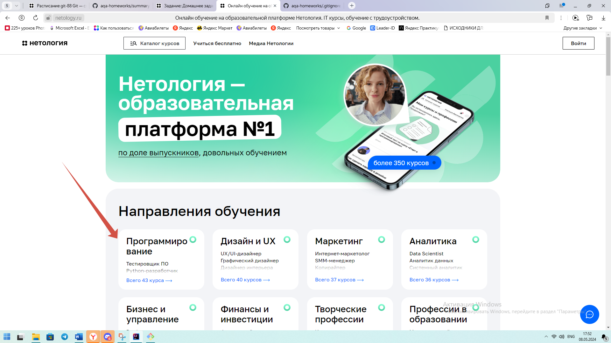
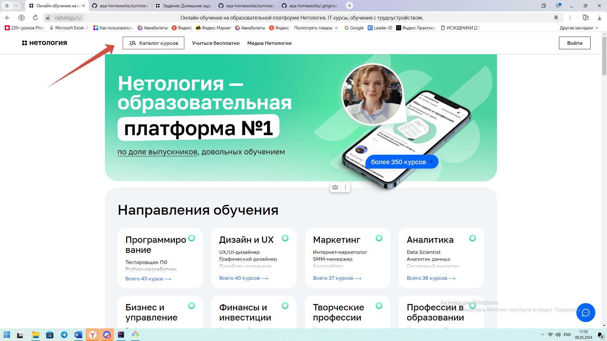
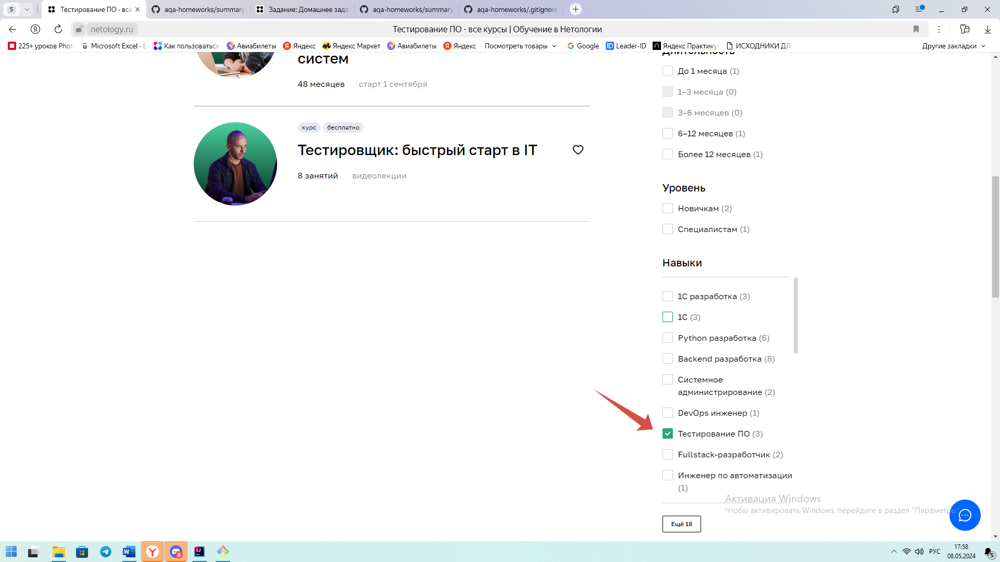
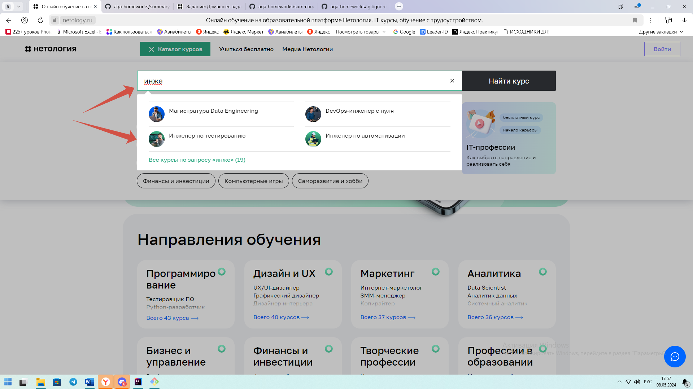

# План тестирования
1. Перечень автоматизируемых сценариев.

**Какие сценарии навигации до страницы курса "Инженер по тестированию" с главной страницы есть?**

1-й сценарий authThroughProgramming

1. Открыть сайт https://netology.ru/.
2. Выбрать Направления обучения - Программирование.
3. Ввести в строку поиска "Инженер по тестированию".
4. Открывается страница курса. Нажать на кнопку "Записаться".
5. Страница переходит вниз на форму со стоимостью курса. Справа - форма записи.
6. Очистить и заполнить форму: "Имя","Телефон","Электронная почта".
7. Нажать кнопку "Записаться".

   

2-й сценарий authThroughCatalog

1. Открыть сайт https://netology.ru/.
2. Нажать кнопку Каталог курсов. Открывается форма поиска.
3. Ввести в строке поиска "Инженер по тестированию".
4. Нажать на название курса.
5. Повторить шаги 4-7 из первого способа.

   

Примечание: можно выбрать курс с помощью фильтра с чек-боксами на странице курсов. Нужно также протестировать выбор курса с вводом в строку поиска неполного наименования курса.

**Перечень автоматизируемых сценариев**
1. Ввод в форму валидных данных shouldAuthIfFieldsAreFilledCorrectly;  
*Пример теста*   
    1.1 Открыть сайт https://netology.ru/.  
    *Ожидаемый результат:* Открывается главная страница сайта.  
    1.2. Выбрать Направления обучения - Программирование.  
    *Ожидаемый результат:* Открывается страница поиска курса со строкой поиска.  
    1.3 Ввести в строку поиска "Инженер по тестированию". Нажать на необходимый курс.  
    *Ожидаемый результат:* У страницы поиска открывается список курсов, в котором стоит "Инженер по тестированию". При нажатии на курс открывается страница курса.  
    1.4 На странице курса нажать на кнопку "Записаться".  
    *Ожидаемый результат:* Страница переходит вниз на форму со стоимостью курса. Справа - форма записи. 
    1.5. Очистить и заполнить форму: "Имя", "Телефон", "Электронная почта". 
    *Описание валидных данных:*
* имя - на кириллице, например "Екатерина";
* телефон - 11 арабских цифр, напромер "+79832579253",
* электронная почта на латинице с существующим доменом - "ekaterinaivanova@gmail.com". 

    1.6 Нажать кнопку "Записаться". 
    *Ожидаемый результат:* Всплывает сообщение: "Ваша заявка принята успешно. С вами свяжется наш менеджер".
2. Ввод в форму имени и фамилии с валидным телефоном и валидной электронной почтой shouldAuthWithNameAndSecondName.  
   *Описание валидных данных:*
* имя и фамилия на кириллице - Екатерина Иванова;  
    *Ожидаемый результат:* Всплывает сообщение: "Ваша заявка принята успешно. С вами свяжется наш менеджер".
3. Ввод в форму имени на латинице с валидным телефоном и валидной электронной почтой shouldNotAuthWithNameInLatin 
    *Описание невалидных данных:*
* имя на латинице - Ekaterina;  
  *Ожидаемый результат:* Поле "Имя" подсвечивается желтым.
4. Ввод в форму имени из одной буквы на кириллице с валидным телефоном и валидной электронной почтой shouldAuthWithNameOneLetter  
   *Описание валидных данных:*
* имя на кириллице из одной буквы - А;  
  *Ожидаемый результат:* Всплывает сообщение: "Ваша заявка принята успешно. С вами свяжется наш менеджер".
5. Ввод в форму двойного имени с дефисом с валидным телефоном и валидной электронной почтой shouldAuthWithNameWithHyphen  
  *Описание валидных данных:*
* имя на кириллице с дефисом - Мария-Елена;  
  *Ожидаемый результат:* Всплывает сообщение: "Ваша заявка принята успешно. С вами свяжется наш менеджер".
6. Ввод в форму двойного имени через пробел с валидным телефоном и валидной электронной почтой shouldAuthWithDoubleName  
   *Описание валидных данных:*
* имя на кириллице с пробелом - Мария Елена;  
  *Ожидаемый результат:* Всплывает сообщение: "Ваша заявка принята успешно. С вами свяжется наш менеджер".
7. Ввод в форму имени с буквой ё с валидным телефоном и валидной электронной почтой shouldAuthWithNameWithSymbol  
   *Описание валидных данных:*
* имя на кириллице с символом ё - Артём;  
  *Ожидаемый результат:* Всплывает сообщение: "Ваша заявка принята успешно. С вами свяжется наш менеджер".
8. Ввод в форму имени спецсимволов, кроме дефиса, с валидным телефоном и валидной электронной почтой shouldNotAuthWithNameWithSpecialSymbols  
   *Описание невалидных данных:*
* имя из спецсимволов, кроме дефиса - "№;%:?*();  
  *Ожидаемый результат:* Под полем имени появляется надпись "Должно состоять из букв".
9. Ввод в форму валидного имени, валидной электронной почты и телефона из 10 цифр shouldNotAuthWithTenNumberPhone  
   *Описание невалидных данных:*
* телефон из 10 цифр - +7983267925;  
  *Ожидаемый результат:* При нажатии кнопки "Записаться" всплывает сообщение: "Номер телефона должен состоять из 11 цифр".
10. Ввод в форму валидного имени, валидной электронной почты и телефона из 12 цифр shouldNotAuthWithElevenNumberPhone  
    *Описание невалидных данных:*
* телефон из 12 цифр - +798326792534;  
  *Ожидаемый результат:* При нажатии кнопки "Записаться" всплывает сообщение: "Номер телефона должен состоять из 11 цифр".
11. Ввод в форму валидного номера телефона и валидной электронной почты с пустым полем имени shouldNotAuthWithEmptyName  
    *Описание невалидных данных:*
* поле "Имя" - пустое;  
  *Ожидаемый результат:* При заполнении формы под полем имени появляется красная надпись "Обязательное поле".
12. Ввод в форму валидного имени и валидной электронной почты с пустым полем телефона shouldNotAuthWithEmptyPhone  
    *Описание невалидных данных:*
* поле "Телефон" - пустое;  
  *Ожидаемый результат:* При нажатии кнопки "Записаться" всплывает сообщение: "Вы не заполнили поле "Телефон"".
13. Ввод в форму валидного имени и валидного номера телефона с пустым полем электронной почты shouldNotAuthWithEmptyEmail  
    *Описание невалидных данных:*
* поле "Email" - пустое;  
  *Ожидаемый результат:* При нажатии кнопки "Записаться" всплывает сообщение: "Вы не заполнили поле "Электронная почта"".
14. Ввод в форму электронной почты на кириллице с валидными именем и телефоном shouldNotAuthWithCyrillicEmail  
    *Описание невалидных данных:*
* поле "Email" на кириллице - провтиааоалд;  
  *Ожидаемый результат:* При введение в поле под полем появляется красная надпись "Неверный email".
15. Ввод в форму электронной почты с несуществующим доменом с валидными именем и телефоном shouldNotAuthWithEmailNonexistentDomain  
    *Описание невалидных данных:*
* поле "Email" c несуществующим доменом - ekaterina@kitkat.com;  
  *Ожидаемый результат:* При введение в поле под полем появляется красная надпись "Неверный email".
16. Ввод в форму электронной почты из спецсимволов с валидными именем и телефоном shouldNotAuthWithEmailWithSpecialSymbols  
    *Описание невалидных данных:*
* поле "Email" из спецсимволов - "№;%:?*()_+;  
  *Ожидаемый результат:* При введение в поле под полем появляется красная надпись "Неверный email".

2. Перечень используемых инструментов с обоснованием выбора. 

   2.1 В проекте используется Selenide, поскольку это эффективный инструмент поиска элементов на странице. 
   2.2 В проекте нужно захардкодить данные (рандомные), поэтому используется библиотека Faker. 
   2.3 Чтобы сгенировать автоматически конструкторы для классов, используется Lombok. 
   2.4 Неплохо бы проверить, что после нажатии кнопки "Записаться", данные попадают в базу данных, поэтому используется Docker, my sql или postgres, DBeaver, как клиент с интерфейсом взаимодействия с базой данных. 
   2.5 Для документирования баг-репортов используется Jira. 
   2.6 Для репортинга используется Allure, поскольку позволяет посмотреть наглядную статистику по тестированию. 
   2.7 Используется браузер Chrome, как один из самых популярных.

3. Перечень необходимых разрешений, данных и доступов. 

   3.1 Для автоматизированного тестирования нужно разрешение использовать API. 
   3.2 Необходим доступ к базе данных, при этом необходимо сделать так, чтобы база очищалась от тестовых данных. 
   3.3 Поскольку для ввода данных используются рандомные данные, данные необходимо захардкодить во вспомогательном классе. 

4. Перечень и описание возможных рисков при автоматизации. 

   4.1 Поиск локаторов элементов на страницах  
   Далеко не все локаторы имеют явные привязки. Поиск путей идентификации элементов может занять дополнительное время.  
   4.2 Обновляемость сайта  
   В ходе выполнения проекта может измениться структура сайта и локаторы придётся уточнять. 

5. Перечень необходимых специалистов для автоматизации.

   5.1 Инженер по тестированию  

6. Интервальная оценка с учётом рисков в часах.  
   6 часов.
